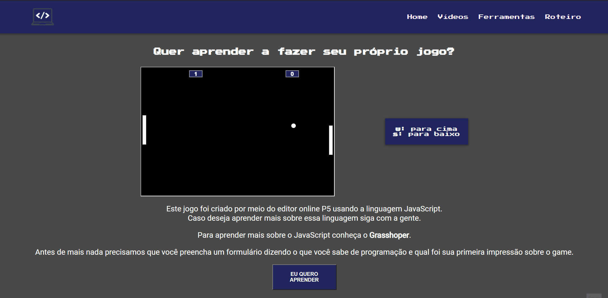

<h1 align="center">Projeto de Extensão</h1>

<h3 align="center">
      
</h3>

Este projeto foi desenvolvido por 3 alunos de Engenharia da Computação da PUC Minas, na disciplina de Introdução a Computação. O intuito do projeto é disponibilizar conteúdo sobre programação gratuito para as pessoas interessadas em aprender sobre o assunto. Para isso, postamos as aulas no YouTube e criamos um site onde também é possível acessar as aulas e conhecer mais sobre o projeto.

<h3>Tecnologias:</h3>

<strong>Tecnologias utilizadas no site: HTML e CSS</strong> 
<strong>Tecnologia utilizada para o desenvolvimento do jogo: JavaScript</strong>

<h3>Canal:</h3>

<h3>Status do Projeto:</h3> 

✔ Finalizado

<h2>Possíveis ações a entrar no site:</h2>
<ul>
  <li>Jogar o jogo criado no curso.</li>
  <li>Assistir os vídeos pelo próprio site.</li>
  <li>Material de apoio para aqueles que estão se iniciando na programação.</li>
  <li>Ver todas as ferramentas utilizadas no projeto.</li>
  <li>Roteiro do trabalho, mostrando todas as etapas passadas durante o desenvolvimento do projeto.</li>
</ul>
<h2>Desenvolvido por:</h2>
<ul>
  <li><a href="https://github.com/davidsonmarra">Davidson Marra</a></li>
  <li><a href="https://github.com/HenriqueIsrael">Henrique Israel</a></li>
  <li><a href="https://github.com/phtsouza">Pedro Souza</a></li>
</ul
